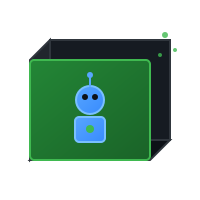

<p align="center">
  
</p>

<h1 align="center">Agentbox</h1>

<p align="center">
<code>
 ______   ______  ________ __    __ ________ __
|  ▓▓▓▓▓▓\  ▓▓▓▓▓▓\ ▓▓▓▓▓▓▓▓ ▓▓\ | ▓▓\▓▓▓▓▓▓▓▓ ▓▓____   ______  __    __
| ▓▓__| ▓▓ ▓▓ __\▓▓ ▓▓__   | ▓▓▓\| ▓▓  | ▓▓  | ▓▓    \ /      \|  \  /  \
| ▓▓    ▓▓ ▓▓|    \ ▓▓  \  | ▓▓▓▓\ ▓▓  | ▓▓  | ▓▓▓▓▓▓▓\  ▓▓▓▓▓▓\\▓▓\/  ▓▓
| ▓▓▓▓▓▓▓▓ ▓▓ \▓▓▓▓ ▓▓▓▓▓  | ▓▓\▓▓ ▓▓  | ▓▓  | ▓▓  | ▓▓ ▓▓  | ▓▓ >▓▓  ▓▓
| ▓▓  | ▓▓ ▓▓__| ▓▓ ▓▓_____| ▓▓ \▓▓▓▓  | ▓▓  | ▓▓__/ ▓▓ ▓▓__/ ▓▓/  ▓▓▓▓\
| ▓▓  | ▓▓\▓▓    ▓▓ ▓▓     \ ▓▓  \▓▓▓  | ▓▓  | ▓▓    ▓▓\▓▓    ▓▓  ▓▓ \▓▓\
 \▓▓   \▓▓ \▓▓▓▓▓▓ \▓▓▓▓▓▓▓▓\▓▓   \▓▓   \▓▓   \▓▓▓▓▓▓▓  \▓▓▓▓▓▓ \▓▓   \▓▓
</code>
</p>

**Safe containers for autonomous AI agents**

Run Claude, Codex, or Gemini with full auto-approve permissions. They can't wreck your system because they're in a container. They can work while you sleep because git tracks everything. If something goes wrong, `git reset --hard` and you're back to normal.

## The Origin Story

I saw [Matt Brown](https://www.youtube.com/@mattbrwn) on YouTube do something wild: he set up a race between himself and an AI agent to reverse engineer an IoT binary exploit using Ghidra and Binary Ninja. Human vs machine, both working in parallel on the same problem.

I thought: **"I want this."**

Not just the competition - the workflow itself. An autonomous agent with full access to specialized tools, multiple directories mounted, complete isolation, safe to detach and let work in the background.

The closest thing was Dev Containers, but those are designed for IDE workflows. I wanted something simpler: Docker for isolation, agent CLIs for execution, no editor dependencies. Just give the agent a sandbox, point it at your project, and let it work.

That's Agentbox.

## The Problem

AI agents are most useful when autonomous - auto-approve changes, run commands without asking, iterate until done. But nobody gives an agent those permissions on their actual machine. We've all heard the stories: an agent runs `rm -rf` in the wrong directory, corrupts a git repo, installs packages that break your system.

The tension is real:
- **Autonomous agents are powerful** - Let them work while you sleep, handle tedious tasks, run in parallel
- **Autonomous agents are dangerous** - Full system access + auto-approve = potential disaster

You *can* do this manually. Git worktrees for parallel branches. Docker for containers. But the ergonomics are terrible - too many commands to remember, flags are painful on phone keyboards, no unified interface.

## The Solution

**First, put agents in a jail.** A Docker container gives them a full dev environment - git, node, python, everything. But it contains the blast radius. If an agent goes rogue, it can only damage what's inside. Your system stays safe.

**Second, wrap it all in a simple CLI.** No flags. Positional arguments only. Designed for phone keyboards and tired brains. One command to start, one to connect, one to manage.

## Quick Start

```bash
# Install
git clone git@github.com:scharc/agentbox.git
cd agentbox
bash bin/setup.sh --shell zsh  # or bash

# Use it
cd ~/myproject
agentbox init
agentbox superclaude
```

That's it. Claude starts working with auto-approve enabled. Give it a task, detach (`Ctrl+A, D`), come back later.

## Features

### Agent Types

**Autonomous agents** run with auto-approve - no permission prompts, continuous execution:
```bash
agentbox superclaude     # Claude with --dangerously-skip-permissions
agentbox supercodex      # Codex autonomous
agentbox supergemini     # Gemini autonomous
```

**Interactive agents** ask permission for each action - good for exploration:
```bash
agentbox claude
agentbox codex
agentbox gemini
```

**Shell** for manual work:
```bash
agentbox shell           # Just bash, no AI
```

### Packages and Tools

Add packages the agent can use:
```bash
agentbox packages add npm typescript
agentbox packages add pip pytest
agentbox packages add apt ffmpeg
agentbox packages add cargo ripgrep
```

Changes auto-rebuild the container.

### Workspace Mounts

Mount additional directories:
```bash
agentbox workspace add ~/other-repo ro reference
agentbox workspace add ~/data rw data
```

Inside the container:
- `/workspace` - Your project (read-write)
- `/context/reference` - Other repo (read-only)
- `/context/data` - Data directory (read-write)

### MCP Servers

Enable MCP servers for extended capabilities:
```bash
agentbox mcp list                    # See available
agentbox mcp add agentbox-analyst    # Enable one
```

Core MCPs:
- **agentctl** - Worktree and session management
- **agentbox-analyst** - Cross-agent review and analysis

### Parallel Work with Worktrees

Run multiple agents on different branches simultaneously:
```bash
agentbox worktree add feature-auth       # Create worktree
agentbox worktree superclaude feature-auth   # Run agent there
agentbox worktree list                   # See all worktrees
```

Each branch gets its own directory. Agents don't interfere.

### Sessions

Run multiple agents in one container:
```bash
agentbox session new superclaude feature     # New session
agentbox session list                        # See sessions
agentbox session attach feature              # Jump to one
```

### Quick Menu (Mobile-Friendly)

Single-keypress navigation for phone keyboards:
```bash
agentbox q
```

Shows sessions, worktrees, actions. Press a letter to act. No typing commands.

### Desktop Notifications

The daemon bridges container and host:
```bash
agentbox service install     # Install as systemd service
```

Get notified when:
- Task completes
- Agent appears stalled
- Something needs attention

### Port Forwarding

Expose container ports without restart:
```bash
agentbox ports expose 3000           # Container → Host
agentbox ports forward 5432          # Host → Container
```

### Container Networking

Connect to other Docker containers:
```bash
agentbox network connect postgres-dev
# Agent can now reach postgres-dev:5432
```

### Automatic Credential Setup

**Zero setup required.** Agentbox automatically shares your host credentials with the container. Authenticate once on your machine, and every container gets access.

Supported credentials:
- **Claude** - `~/.claude/.credentials.json` (OAuth tokens)
- **Codex** - `~/.codex/auth.json`
- **OpenAI** - `~/.config/openai/`
- **Gemini** - `~/.config/gemini/`
- **Git** - Author name/email from environment

How it works:
1. Host credential directories are mounted into the container
2. Container-init creates symlinks to the expected locations
3. OAuth token refresh works both ways (mounts are read-write)

This means:
- No `claude login` inside containers
- Tokens auto-refresh without breaking
- New containers immediately have access

**SSH keys** are configurable via `.agentbox.yml`:
```yaml
ssh:
  mode: keys           # Copy keys (default)
  # mode: mount        # Bind mount ~/.ssh
  # mode: config       # Config only (use with forward_agent)
  # mode: none         # No SSH
  forward_agent: false # Forward SSH agent socket
```

### Device Passthrough

Give agents access to hardware devices. The interactive chooser shows what's available:
```bash
agentbox devices              # Interactive selection
agentbox devices add /dev/snd # Or add directly
```

The chooser auto-detects audio devices, GPUs, serial ports, and cameras on your system. Devices that go offline won't break the container - they're skipped automatically at startup.

### Docker Socket Access

Give agent control of Docker (use with caution):
```bash
agentbox docker enable
```

## The Mobile Workflow

I use Agentbox as my daily driver. Here's what that looks like:

Start an agent on my laptop with a task. Detach. Go get coffee.

From my phone, SSH into my laptop via Tailscale. Run `agentbox q` to see the quick menu. Check on the agent. Maybe start another one on a different branch.

Get a notification when it's done. Review from wherever I am.

Multiple agents, multiple branches, all from my phone. The quick menu makes it practical.

## How It Works

```
┌─────────────────────────────────────────┐
│ YOUR MACHINE (Host)                     │
│                                         │
│   agentbox superclaude                  │
│   agentbox connect                      │
│   agentbox stop                         │
│                                         │
│   agentboxd (daemon)                    │
│   ├── Desktop notifications             │
│   ├── Stall detection                   │
│   └── Port forwarding                   │
└─────────────────────────────────────────┘
              ↕ SSH tunnel
┌─────────────────────────────────────────┐
│ CONTAINER (Agent's World)               │
│                                         │
│   /workspace (your code)                │
│   /context/* (extra mounts)             │
│                                         │
│   Agent working autonomously...         │
│   ├── Edits files                       │
│   ├── Runs tests                        │
│   ├── Commits changes                   │
│   └── Notifies when done                │
└─────────────────────────────────────────┘
```

Two isolated worlds. The agent works safely inside. The daemon connects them.

## Container Management

```bash
agentbox list            # Running containers
agentbox list all        # Include stopped
agentbox info            # Container details
agentbox stop            # Stop container
agentbox remove          # Delete container
agentbox rebase          # Rebuild with new config
```

## Safety

**Container isolation:** Agents can only access the project directory and explicitly mounted paths. Your system, other projects, and home directory are unreachable.

**Git safety net:** Every change is tracked. Easy to review (`git diff`), easy to undo (`git reset --hard`).

**Credential isolation:** SSH keys (in `keys` mode) are copied into the container - changes don't affect your host. API tokens are synced to support OAuth refresh.

**Worst case:** Agent corrupts the project? `git reset --hard`. Container breaks? `agentbox remove && agentbox superclaude`. Back to normal in seconds.

## Prerequisites

- **Docker** - Container runtime
- **Python 3.12+** - For the CLI
- **Poetry** - Python dependency management
- **Agent CLI** - At least one: [Claude Code](https://docs.anthropic.com/en/docs/claude-code), Codex, or Gemini

## Documentation

**The Story (start here):**
1. [Why Agentbox Exists](docs/01-why.md) - The origin story
2. [Two Worlds](docs/02-two-worlds.md) - Architecture
3. [First Steps](docs/03-first-steps.md) - Your first agent
4. [The Dangerous Settings](docs/04-dangerous-settings.md) - Agent types
5. [Parallel Work](docs/05-parallel.md) - Sessions and worktrees
6. [Work From Anywhere](docs/06-mobile.md) - Mobile workflow
7. [Day-to-Day](docs/07-containers.md) - Container management
8. [All the Options](docs/08-configuration.md) - Configuration

**Reference:**
- [REF-A: CLI Reference](docs/REF-A-cli.md) - All commands
- [REF-B: Daemon](docs/REF-B-daemon.md) - agentboxd
- [REF-C: Container CLI](docs/REF-C-agentctl.md) - agentctl
- [REF-D: Tunnel Protocol](docs/REF-D-tunnel.md) - Technical details
- [REF-E: Library](docs/REF-E-library.md) - MCPs and skills
- [REF-F: Agent Collaboration](docs/REF-F-collaboration.md) - Peer review workflow
- [REF-G: Network Connections](docs/REF-G-network.md) - Container networking
- [REF-H: Analyst MCP](docs/REF-H-analyst.md) - Cross-agent analysis

**For agents working on Agentbox:**
- [AGENT: Architecture Guide](docs/AGENT-architecture.md)
- [AGENT: Quick Reference](docs/AGENT-QUICK-REF.md)

## Contributing

See [CONTRIBUTING.md](CONTRIBUTING.md) for guidelines.

Areas that need help:
- Documentation improvements
- Bug reports and fixes
- Testing experimental features

## License

MIT

## Support

- Issues: https://github.com/scharc/agentbox/issues
- Discussions: https://github.com/scharc/agentbox/discussions
